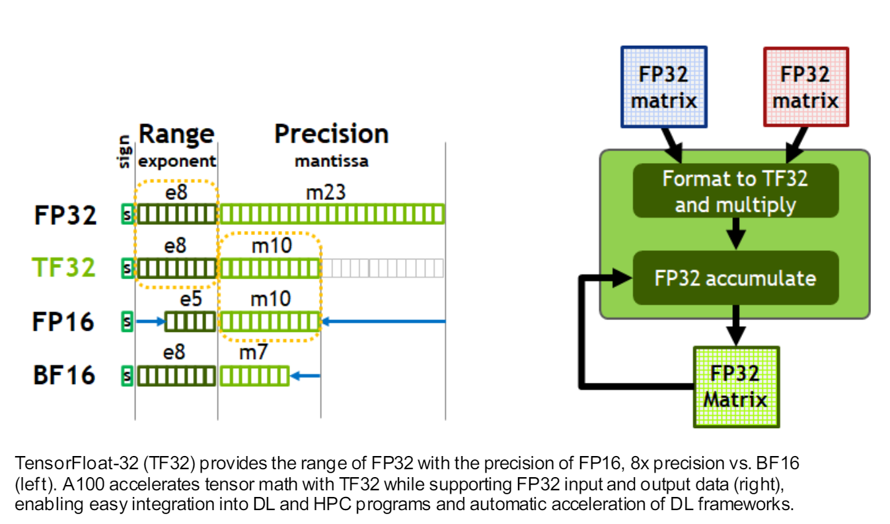

# GPT-2

本项目通过实现GPT2（124M Parameters）学习大模型相关技术。实验在单节点 3*A100 80G GPUs 设备上进行。

# 快速开始
1. `gpt2.py` GPT2模型结构。具体介绍请参考代码注释，下面根据个人情况记录一下细节：
   
   (1) **Token Embedding层和lm_head参数共享**
   
   Token Embedding 和 lm_head 分别是将token映射成为向量和将向量映射成为token, 他们的weight的shape属性都是(vocab_size * n_embd)。nn.Linear() 的forward() 调用的是F.linear()函数，具体参考pytorch[官方文档](https://pytorch.org/docs/stable/generated/torch.nn.functional.linear.html#torch.nn.functional.linear)。另外为什么共享？[依据在这里](https://arxiv.org/abs/1608.05859)论文还没看，看后补上
    
    (2) **模型参数初始化--方差**
   ```
   def init_weight(self, module):
        # init model weight
        std = 0.02
        if isinstance(module, nn.Linear):
            torch.nn.init.normal_(module.weight, mean=0.0, std=std)
            if module.bias is not None:
                torch.nn.init.zeros_(module.bias)
        elif isinstance(module, nn.Embedding):
            torch.nn.init.normal_(module.weight, mean=0.0, std=std)
    
   ```
   上面是常用的模型初始化代码，但是GPT2采用了
   ```
   def init_weight(self, module):
        # init model weight
        std = 0.02
        if isinstance(module, nn.Linear):
            if hasattr(module, "FLAG"): 
                std *= (2*self.config.n_layer)**-0.5
            torch.nn.init.normal_(module.weight, mean=0.0, std=std)
            if module.bias is not None:
                torch.nn.init.zeros_(module.bias)
        elif isinstance(module, nn.Embedding):
            torch.nn.init.normal_(module.weight, mean=0.0, std=std)
    
   ```
   embedding层的参数正常初始化，然而对其他有FLAG标记的模块的方法差进行了scalling，为什么？
   ```
    import torch

    x = torch.zeros(768)
    n = 100
    for i in range(n):
        x += torch.randn(768)
    print(x.std())
    # tensor(9.6580)
   ```
   我们发现tensor`x`经过多次残差连接后他的方差变大了！！！为了控制方差范围，我们对其进行scalling,并选择了残差链接的次数作为缩放因子。
    ```
    import torch

    x = torch.zeros(768)
    n = 100
    for i in range(n):
        x += n**-0.5 * torch.randn(768)
    print(x.std())
    # tensor(1.0784)
   ```
   最后采用的方差为 `std *= (2*self.config.n_layer)**-0.5`，2的原因是每个block使用了两个残差链接。

    (3)**加速训练**
    
    通过下面的加速方法，模型的吞吐量增加了10倍！！
   * [torch.set_float32_matmul_precision("high")](https://pytorch.org/docs/stable/generated/torch.set_float32_matmul_precision.html)。
        ```
        torch.set_float32_matmul_precision("high") # line 235
        ```
        
        
        上图来源于[英伟达白皮书 P-27](https://images.nvidia.com/aem-dam/en-zz/Solutions/data-center/nvidia-ampere-architecture-whitepaper.pdf)。A100支持多种类型的浮点数，浮点数的表示被分为符号位、范围、精度三个部分，常用的有FP32， FP16，BF16。Pytorch框架在默认情况下通常适用FP32类型进行表示和计算。A100提供了利用TF32的加速方案，计算时利用TF32数据类型，与FP32相比TF32精度少了13位，减少了计算量但是牺牲了一定的精度
        ```
        # 加速前
        step 0 | loss 11.00 | dt 2217.17ms | tokens/sec 7389.60
        step 1 | loss 9.47 | dt 1000.57ms | tokens/sec 16374.65
        step 2 | loss 9.20 | dt 1001.27ms | tokens/sec 16363.18
        ...
        step 49 | loss 6.17 | dt 1000.40ms | tokens/sec 16318.75
        # 加速后
        step 0 | loss 11.00 | dt 1440.40ms | tokens/sec 11374.59
        step 1 | loss 9.47 | dt 335.34ms | tokens/sec 48857.80
        step 2 | loss 9.20 | dt 335.67ms | tokens/sec 48809.88
        ...
        step 49 | loss 6.17 | dt 337.32ms | tokens/sec 48570.87
        ```
        模型的吞吐量（每秒处理的token数量）增加了3倍！

   * [混合精度训练](https://pytorch.org/tutorials/recipes/recipes/amp_recipe.html)
        ```
        with torch.autocast(device_type=device, dtype=torch.bfloat16): # line 254
                logits, loss = model(x, y)
        ```
        ```
        step 0 | loss 11.00 | dt 1480.05ms | tokens/sec 11069.93
        step 1 | loss 9.47 | dt 301.76ms | tokens/sec 54294.68
        step 2 | loss 9.20 | dt 301.41ms | tokens/sec 54358.50
        ...
        step 49 | loss 6.17 | dt 301.22ms | tokens/sec 54391.98
        ```

   * 模型编译
   
        `torch.compile`通过分析模型，并优化模型读写策略提高模型的吞吐量。
        ```
        model = torch.compile(model) # line 246
        ```
        ```
        step 0 | loss 11.00 | dt 30385.38ms | tokens/sec 539.21
        step 1 | loss 9.47 | dt 187.48ms | tokens/sec 87391.33
        step 2 | loss 9.20 | dt 174.32ms | tokens/sec 93986.53
        ...
        step 49 | loss 6.17 | dt 175.17ms | tokens/sec 93533.17
        ```

   * Falsh Attention
        ```
        y = F.scaled_dot_product_attention(q, k, v, is_causal=True) # line 53 flash attention
        ```
        ```
        step 0 | loss 11.00 | dt 25296.87ms | tokens/sec 647.67
        step 1 | loss 9.47 | dt 156.03ms | tokens/sec 105008.22
        step 2 | loss 9.20 | dt 144.72ms | tokens/sec 113210.73
        ...
        step 49 | loss 6.17 | dt 145.36ms | tokens/sec 112716.60
        ```
   * 超参数采用16、32、64、128...的倍数
        ```
        vocab_size: int = 50304 # line 13 50257->50304
        ```
        ```
        step 0 | loss 10.98 | dt 25912.28ms | tokens/sec 632.29
        step 1 | loss 9.51 | dt 125.21ms | tokens/sec 130849.63
        step 2 | loss 9.33 | dt 119.33ms | tokens/sec 137294.25
        ...
        step 49 | loss 6.20 | dt 111.18ms | tokens/sec 147362.33
        ```

2. `gpt2_size.py`模型参数量估计
  
   (1) model_size()函数忽略了中间过程变量，在实际使用中，模型占用的内存比这个要多，因为pytorch要维护一个计算图，记录中间过程，这些中间过程将用于反向传播过程，比如gradient-checkpoint技术就是通过优化中间过程变量来减少内存占用的
   
   (2) `est_FLOPs()`函数用来评估gpt2模型的浮点数操作，[这里是FLOPS、FLOPs和MACs的定义](https://zhuanlan.zhihu.com/p/649993943)
   
    **FLOPS**（Floating Point Operations per Second）指每秒浮点运算次数，可以理解为评估设备计算速度的单位。
    
    **FLOPs**（Floating Point Operations）指浮点运算次数，可以理解为描述模型需要的总计算量的单位。从拼写上容易与FLOPS弄混。

    本函数仅仅计算weight相关的FLOPs，忽略了softmax以及layernorm等相关的浮点数操作。例如对于A (BxC) @ B (CxD) -> (BxD) flops are 2\*B\*C\*D

  

# 致谢

非常感谢karpathy大神

https://github.com/karpathy/nanoGPT

https://github.com/karpathy/build-nanogpt
